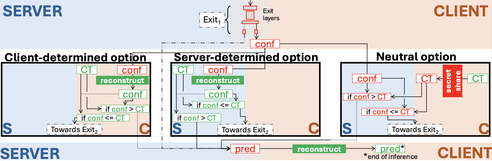

### 🦘 QUOKKA: Fast, Faster, Secure Neural Network Inference with Early-Exit Technology

# Description

QUOKKA implements a novel system for accelerated and secure neural network inference using Early Exit Convolutional Neural Networks (EENets). Specifically designed for two-party scenarios, QUOKKA enables confidential inference through Secure Multi-Party Computation (sMPC) using the Crypten Secure Neural Network Inference (SNNI) protocol (https://crypten.ai), dramatically reducing latency by allowing the model to exit early when a high-confidence prediction is reached.

This repository supports both plaintext and secure (SMPC) inference.

This work is detailed in the paper: QUOKKA: Fast Faster Secure Neural Network Inference with Early-Exit Technology, accepted to the 18th International Symposium on Foundations & Practice of Security (FPS - 2025).

# Architectural Overview

QUOKKA is a two-party system designed to run on separate machines, where one acts as the Server (Rank 0) and the other as the Client (Rank 1).

Server (Rank 0): Hosts the bulk of the EENet model weights and orchestrates the inference process.

Client (Rank 1): Provides the input data and receives the final prediction.

QUOKKA supports inference only. For training EENets, please refer to the original implementation repository (https://github.com/eksuas/eenets.pytorch).

The repository is organized into distinct functional units:

server/ :Contains scripts and logic to be run on the Server (Rank 0) machine.

client/ : Contains scripts and logic to be run on the Client (Rank 1) machine.

For each, the QUOKKA options are in folders:

    +/client/server

        -/plaintext

        -/secure_option_CLIENTDETERMINED

        -/secure_option_SERVERDETERMINED

        -/secure_option_NEUTRAL

and the helper files are all the remaining .py files.

In each option folder,

    -/models are defined in eenet.py or secure_eenet.py

    -/trained model file and other arguments are ingested in init.py or secure_init.py

    -/secure_main.py or main.py execute the inference

    -/secure_resnet.py or resnet.py contain the original exit-free model architecture (not used)

# Installation

The codes are developed with Python 3.5+ and PyTorch (tested with Linux).

## Prerequisites

Python 3+

PyTorch (installation instructions here)

A two-machine setup (for secure inference).

# Steps

## Clone the repository:

git clone https://github.com/edgesnni/QUOKKA.git

cd QUOKKA

## Install Python dependencies:

pip install -r requirements.txt

# Data Setup

The system requires your datasets (or the test set) to be organized in a specific structure, inherited from the original EENets project. Datasets are expected to be in the directory /data/ relative to the QUOKKA root directory. Note that QUOKKA was only tested on CIFAR10 and Tiny Imagenet trained models.

    +/data

        -/cifar10

        -/imagenet

        -/mnist

        -/svhn

        +/tiny-imagenet

            - /train

            - /val    

# Configuration (Crucial for Secure Mode)

For secure inference to work, the Client and Server machines must be able to communicate via PyTorch's distributed process group.

Before running the run.sh script on both machines, you MUST configure the following parameters within the common and throttle scripts (located in the respective directories):

## In common.sh: 

    MASTER_ADDR # For both server and client machines, write server's IP

    MASTER_PORT

    GLOO_SOCKET_IFNAME

## In throttle.sh:

    DEV  # Same as GLOO_SOCKET_IFNAME in common.sh

    For the client, insert server's ip in iperf3 -c

# Usage

Inference is initiated using the main run.sh script, which handles the distributed setup and calls the necessary Python files. run.sh needs to be manually modified to determine
-the name of the .pth file where the trained model is stored
-the dataset to use for inference
-the model contained in the .pth file
-the desired number of exits (must be same as what was trained on)
-the exit type (must be same as what was trained on)
-the method of distribution of exits (must be same as what was trained on)
-the confidence threshold

## 1. Plaintext Inference (No arguments)

This mode performs standard, unsecured early-exit inference. 
### To start the plaintext inference on the server:
    ./run.sh

## 2. Secure (SNNI) Inference (Required arguments)

When running in secure mode, the run.sh script must be executed on both machines simultaneously. The script requires one argument to specify the type of secure exit policy to use.

There are 3 options for QUOKKA: 

a. Server-Determined (Server determines the exit point based on confidence)
b. Client-Determined (Client determines the exit point based on confidence)
c. Neutral (Neither party obtains the confidence score)

Example Execution (on both Server and Client):

### To start the Server-Determined secure inference:
    ./run.sh S

### To start the Neutral secure inference:
    ./run.sh N

### To start the Client-Determined secure inference:
    ./run.sh C

# 📜 License and Acknowledgements

License

This project is released under the MIT License. See the full text in the accompanying LICENSE.md file.

Acknowledgements

This repository is built upon and significantly modifies the work from the following project, which provides the base EENets implementation:

Edanur Demir - EENets: Early Exit Convolutional Neural Networks

## Authors

* **Daphnee Chabal** - *QUOKKA: Fast Faster Secure Neural Network Inference with Early-Exit Technology*

